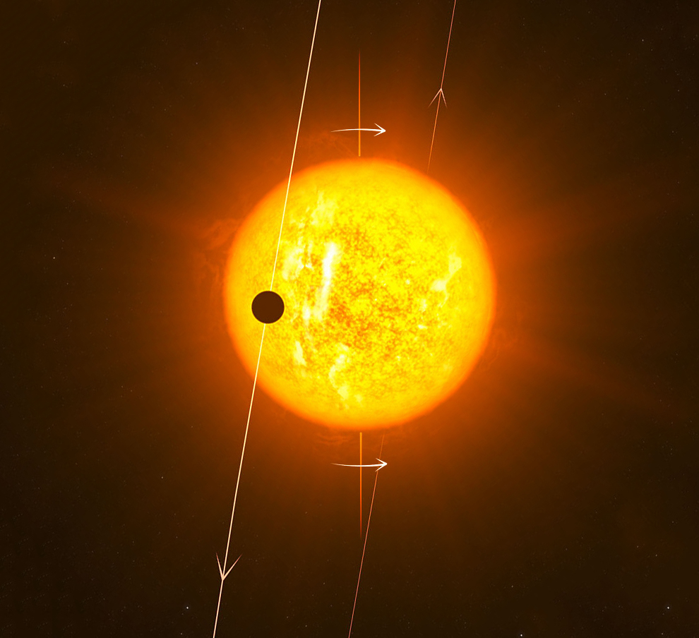
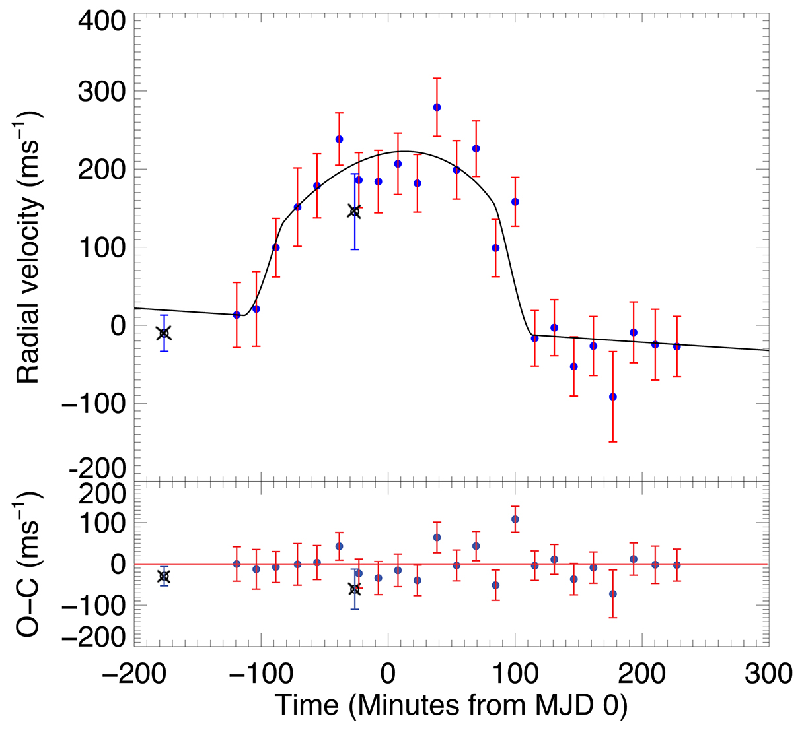

# Predicting the Orbital Obliquities of Extrasolar Planets using Random Forest Regression

Jupyter notebook containing Python code for predicting exoplanet orbital obliquities using machine learning (ML) random forest (RF) regression models. Additionally it contains the results from these model fits.

## Description
This Jupyter notebook investigates the orbital obliquity of exoplanets by using a random forest regression machine learning model to build a predictive model to predict the obliquity of an exoplanet based on the properties of the planet itself and host star (the model features). Additionally, I also investigate the correlations and significant of those correlations between obliquity and the properties of a planet and its host star.

Orbital obliquity is the measure of the alignment (i.e., angle) between a planet's orbit (orbital plane/normal) and the equator of its host star (the perpendicular to the spin axis), a quantity also known as spin-orbit alignment (e.g., see, [Rossiter 1924](https://ui.adsabs.harvard.edu/abs/1924ApJ....60...15R/abstract), [McLaughlin 1924](https://ui.adsabs.harvard.edu/abs/1924ApJ....60...22M/abstract), [Queloz et al. 2000](https://ui.adsabs.harvard.edu/abs/2000A%26A...359L..13Q/abstract), [Addison et al. 2013](https://ui.adsabs.harvard.edu/abs/2013ApJ...774L...9A/abstract)). A planet's orbit is considered aligned if the measured angle between its orbit and host star equator is consistent with zero degrees. The reason for measuring this exoplanet property is that it provides insights into the formation and evolutionary/migration history of planets (see the review by [Dawson \& Johnson 2018](https://ui.adsabs.harvard.edu/abs/2018ARA%26A..56..175D/abstract)). Obliquity has traditionally been measured via spectroscopy for transiting exoplanets, either by measuring the radial velocity anomaly (a.k.a., the Rossiter-McLaughlin Effect) or the distortion of the stellar line profile, produced during a transit.

Below on the left is an artist impression of the hot Jupiter, WASP-79b, with its orbit misaligned by close to 90 degrees (near polar orbit) and on the right, the Rossiter-McLaughlin Effect velocity anomaly as measured for WASP-79b.
<figure>
    
    
</figure>

Of particular interests are the existence of the so-called 'hot Jupiters', planets with masses and radii similar to that of Jupiter but on orbits well-inside the equivalent orbit of Mercury around the Sun and are therefore, very hot versions of Jupiter. In fact, the most extreme hot Jupiters have orbital periods of less than 1 day! The Solar System obviously does not have a hot Jupiter and their existance is difficult to explain (despite their low occurrence rates). The widely accepted model of planet formation, core-accretion, does not predict the existence of these planets, instead it predicts Jupiter mass planets must form beyond the 'ice-line', about the same distance as Jupiter is from the Sun in the Solar System, where icy volatiles can exist in solid state and can build giant planets. It is thought that hot Jupiters initially formed out beyond the ice-line and then migrated inwards with the process of migration dictating the degree of alignment between the planet's orbit and the host star's equator.

The sample of planet's with measured obliquities has grown in recent years and there are currently nearly 230 planets that have this measurement, see catalog given on [TEPCat](https://www.astro.keele.ac.uk/jkt/tepcat/obliquity.html). The sample size has grown to the point where I believe we can start to really explore potential correlations between the various properties of exoplanets and their host star's with orbital obliquity, which may provide insights into the formation and migration history of exoplanets. In fact, previous studies have shown that there appears to be positive correlation between the effective temperature of the host star and orbital obliquity (first noted by [Winn et al. 2010](https://ui.adsabs.harvard.edu/abs/2010ApJ...718L.145W/abstract) and extensively studied by others, e.g., see review by [Albrecht et al. 2022](https://ui.adsabs.harvard.edu/abs/2022PASP..134h2001A/abstract)). One way to probe potential correlations is to use machine learning techniques to develop a model to try to predict orbital obliquity of an exoplanet based on the system's properties (features). To do this, I construct a random forest model from Scikit-learn to train on a portion of the dataset and then predict obliquities on another portion of the dataset that was not trained on. Additionally, I evaluate the performance of my random forest model using a K-fold cross validation technique where I split the dataset into k groups. The model is then evaluated k times, where k-1 groups are used to train each model and one group is used for testing (the testing and training groups are changed at every model evaluation). I also explore a few different ways of handling missing data as well as the steps taken to clean my dataset. Obliquity data comes from the catalogue of the physical properties of transiting planetary systems ([TEPCat](https://www.astro.keele.ac.uk/jkt/tepcat/)) and most of the other planetary and host star properties come from the [NASA Exoplanet Archive](https://exoplanetarchive.ipac.caltech.edu/).

## Getting Started

### Dependencies

In general, these functions will require at minimum:
* Python 3.7 or newer
* Numpy
* Pandas
* Matplotlib
* Sklearn
* csv
* re
* requests
* datetime
* Astroquery
* pyvo
* Seaborn
* Bokeh
* Scipy
* tqdm

### Installing

* Download the Jupyter notebook file (orbital_obliquity_exoplanet_regression.ipynb) and put them in an easy to access directory.
* Ensure your Python environment has the required Python libraries as noted above.

### Executing program

* In the terminal, cd to directory where you have placed the Jupyter notebook file.
* Open the Jupyter notebook file by first starting a Jupyter notebook session via the terminal command: jupyter notebook. Then open the file in the Jupyter notebook session.
* You may need to change hard coded directories in the Python code within the Jupyter notebook as appropriate.

## Help

You can email me if you are having issues getting the Jupyter notebook to work or if there are bugs in the code.

## Authors

Dr. Brett Addison  
astrobrett2005@gmail.com

## Version History

* 1.0
    * Initial Release

## License

The software is freely available at https://github.com/baddison2005/exoplanet_obliquity_ML_regression under the GPL-3.0 license.
